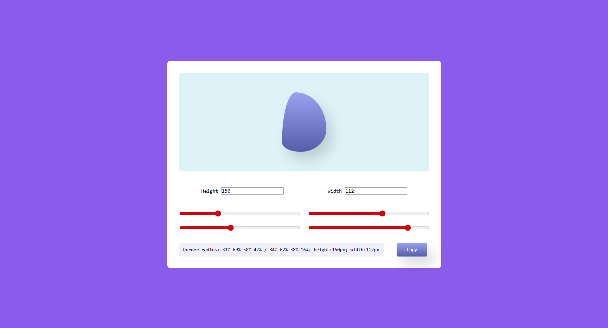

# Blob Maker
An interactive tool for creating and customizing organic shapes (Blobs) and generating corresponding CSS code.

## Preview

&nbsp;

## 🔗 Project Link

&nbsp;

## Key Features
Generate organic shapes using advanced border-radius properties

Control blob dimensions (width and height)

4 sliders to adjust different curvature points of the blob

Real-time visual feedback

Automatic CSS code generation

One-click code copying functionality

&nbsp;

## How to Use
Adjust the width and height values

Modify the sliders to create your desired shape

Copy the generated CSS code and use it in your project

&nbsp;

## Technologies Used
HTML

CSS

JavaScript

&nbsp;

## Technical Notes

Simple and intuitive user interface

Lightweight and optimized code

This tool is useful for web designers and developers who want to add organic shapes and natural curves to their designs.

&nbsp;

## ⭐ Support the Project

If you like this project, give it a star ⭐ on GitHub — it really helps!

&nbsp;

## 📬 Contact

  
  
  

&nbsp;

## 📄 License

This project is licensed under the **MIT License**.